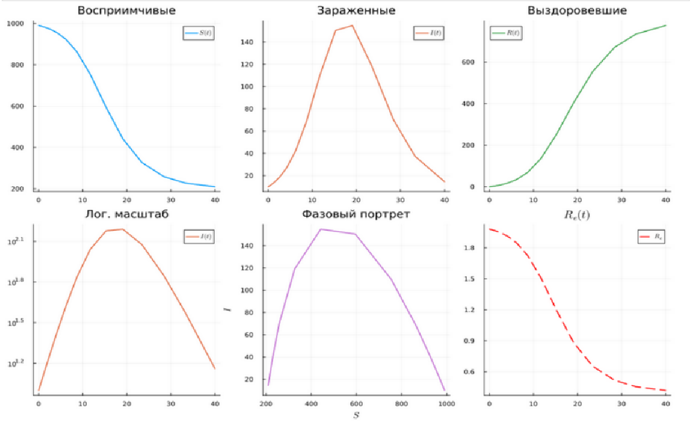
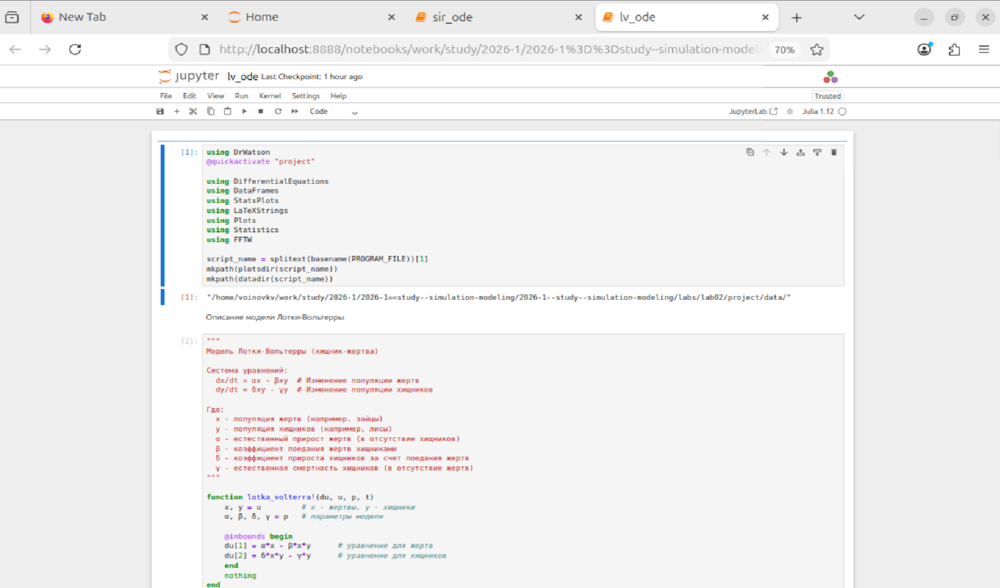
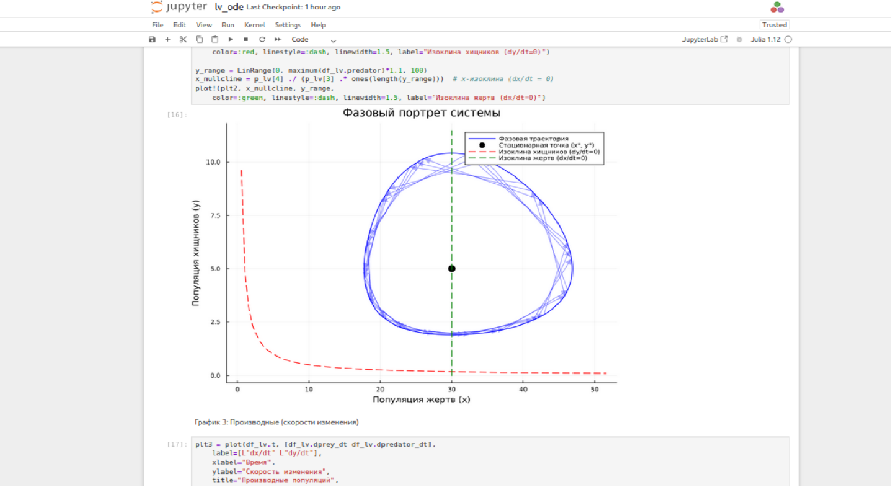

---
## Author
author:
  name: Воинов Кирилл
## Title
title: Презентация по лабораторной работе №2
date: today
date-format: "YYYY-MM-DD" # Example: 2025-09-06
---

# Информация

## Докладчик

:::::::::::::: {.columns align=center}
::: {.column width="70%"}

  * Воинов Кирилл Викторович
  1132236017 НФИбд-01-23

:::
::: {.column width="30%"}

:::
::::::::::::::

## Цели и задачи

Цель данной лабораторной работы - знакомство с основными моделями: SIR и  Модель Лотки–Вольтерры.

# Выполнение лабораторной работы

## Создание файла  sir_ode.jl.

{#fig-001 width=70%}

## Выполнение файла sir_ode.jl

{#fig-002 width=70%}

## Создание файла lv_ode.jl.

{#fig-003 width=70%}

## Выполнение файла lv_ode.jl

{#fig-004 width=70%}

## Создание производных форматов

{#fig-005 width=70%}

## Выполнение Jupyter-ноутбук sir_ode.ipynb

{#fig-006 width=70%}

## Вывод графика болезни

{#fig-007 width=70%}

## Выполнение Jupyter-ноутбук lv_ode.ipynb

{#fig-008 width=70%}

## Вывод фазового портрета системы

{#fig-009 width=70%}

## Вывод других графиков

{#fig-010 width=70%}

# Выводы

Выполнение этой лабораторной работы представило основные модели: SIR и  Модель Лотки–Вольтерры

