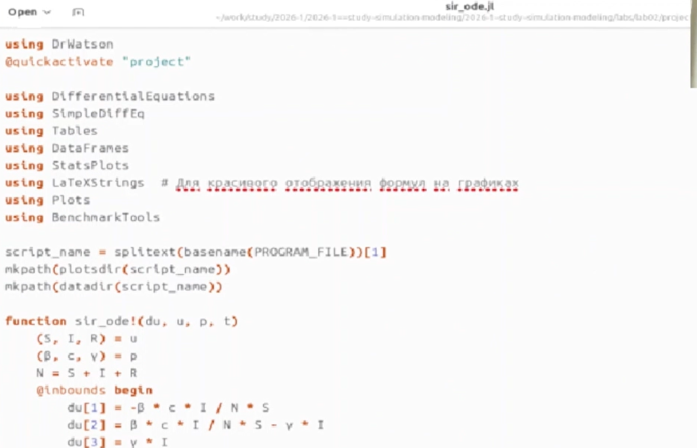
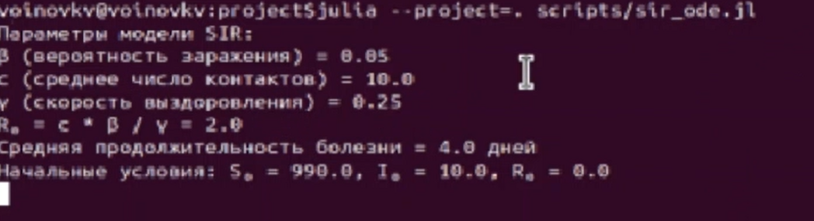
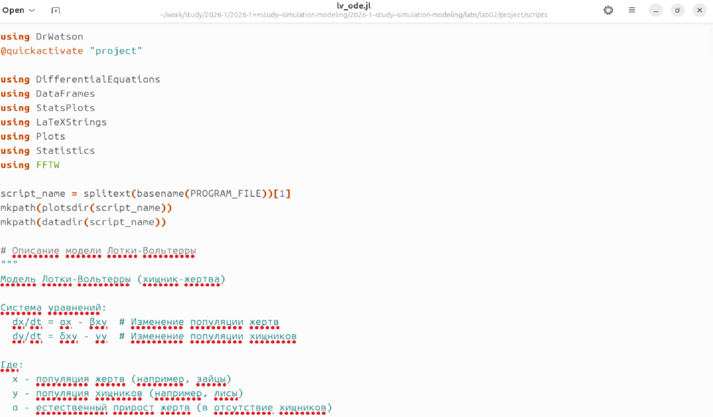
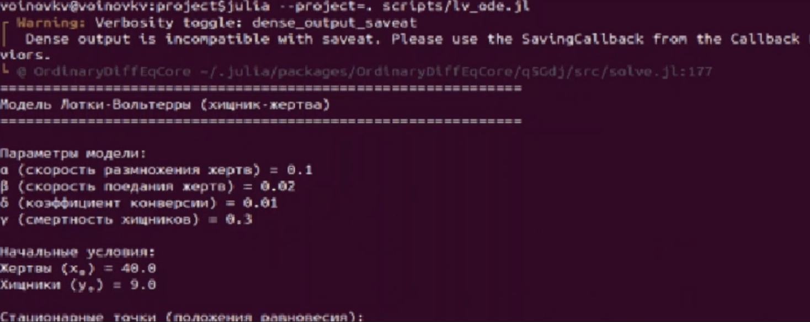
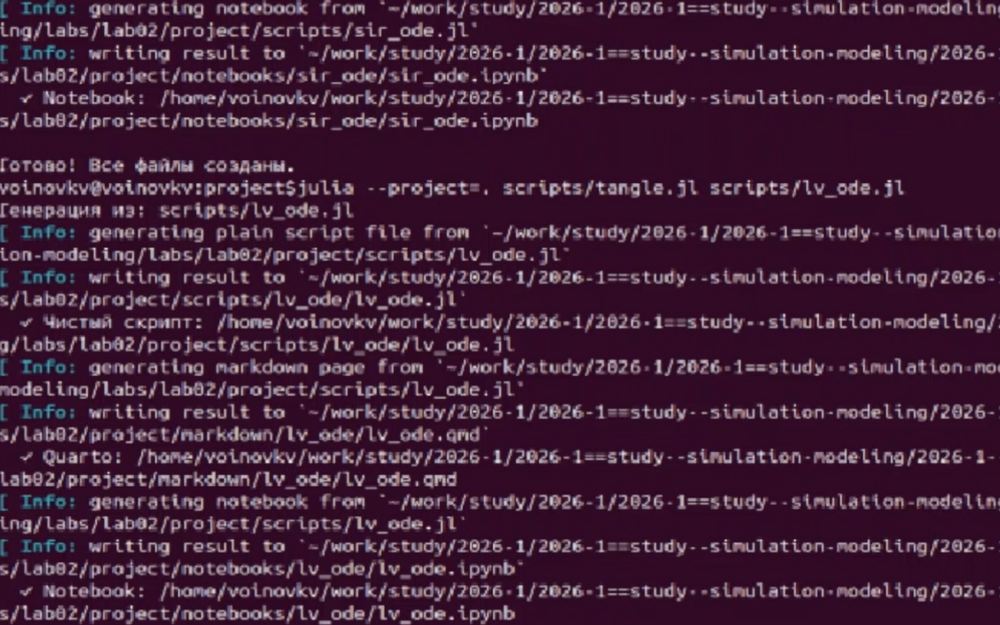
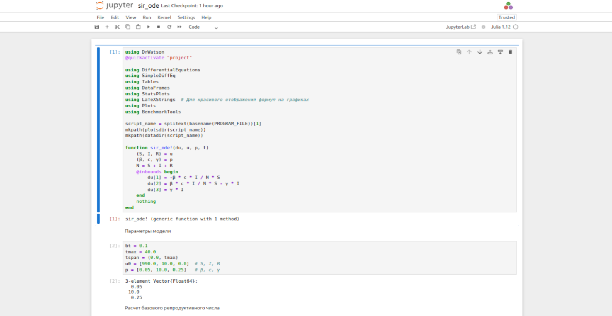
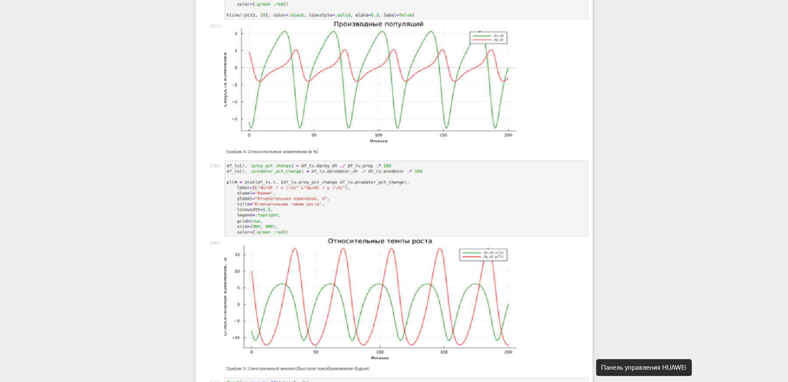

---
## Author
author:
  name: Воинов Кирилл

  affiliation:
    - name: Российский университет дружбы народов
      country: Российская Федерация
      postal-code: 117198
      city: Москва
      address: ул. Миклухо-Маклая, д. 6

## Title
title: "Отчет по лабораторной работе №2"

---

# Цель работы

Цель данной лабораторной работы - знакомство с основными моделями: SIR и  Модель Лотки–Вольтерры.

# Выполнение лабораторной работы

Устанавив все необходимые пакеты создаю файлы sir_ode.jl ([рис. @fig-001]) и lv_ode.jl ([рис. @fig-002]) и вписываю приложенный код.

{#fig-001 width=70%}

{#fig-002 width=70%}

Выполняю файл sir_ode.jl ([рис. @fig-003]).

{#fig-003 width=70%}

Выполняю файл lv_ode.jl ([рис. @fig-004]).

{#fig-004 width=70%}

Создаю производные форматы([рис. @fig-005]).

{#fig-005 width=70%}

Выполняю Jupyter-ноутбук sir_ode.ipynb ([рис. @fig-006]).

{#fig-006 width=70%}

Вывожу графики болезни ([рис. @fig-007]).

{#fig-007 width=70%}

Выполняю Jupyter-ноутбук lv_ode.ipynb ([рис. @fig-008]).

{#fig-008 width=70%}

Вывожу фазовый портрет системы ([рис. @fig-009]).

{#fig-009 width=70%}

Вывожу другие графики ([рис. @fig-010]).

{#fig-010 width=70%}

# Выводы

В итоге этой лабораторной работы я ознакомился с основными моделями: SIR и  Модель Лотки–Вольтерры

#



