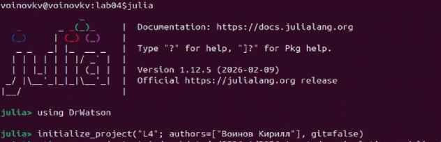
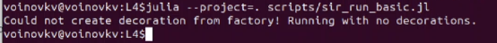
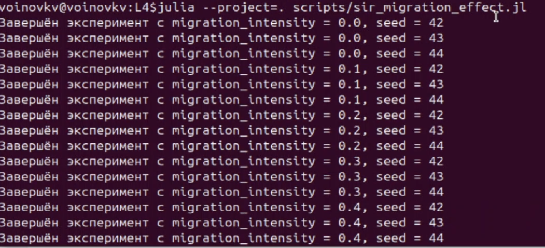
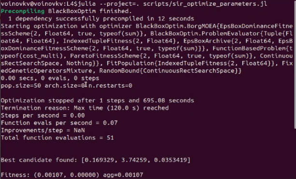
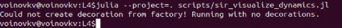
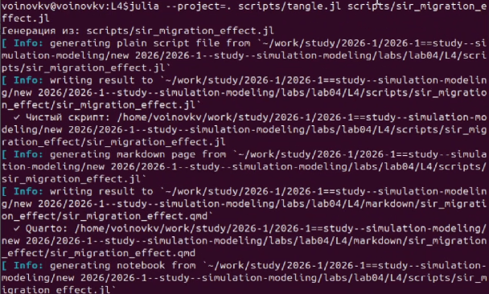
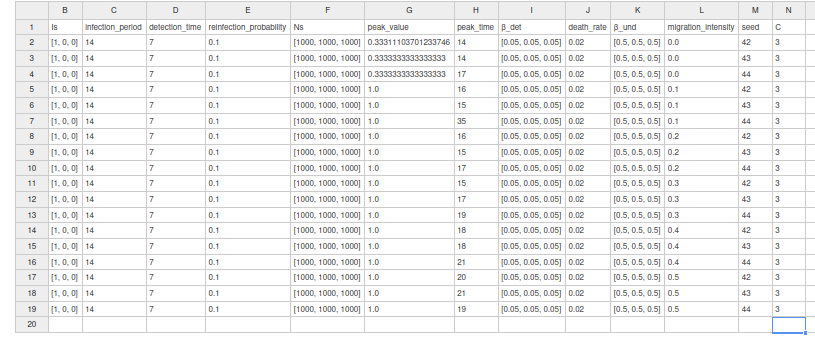
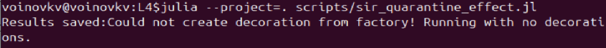

---
## Author
author:
  name: Воинов Кирилл
## Title
title: Презентация по лабораторной работе №4
date: today
date-format: "YYYY-MM-DD" 
---

# Информация

## Докладчик

:::::::::::::: {.columns align=center}
::: {.column width="70%"}

  * Воинов Кирилл Викторович
  1132236017 НФИбд-01-23

:::
::: {.column width="30%"}

:::
::::::::::::::

# Цель и задачи

## Цель работы

- Реализовать агентную модель SIR
- Организовать проект в структуре DrWatson
- Выполнить серию экспериментов

## Задание

1. Создать проект и установить пакеты
2. Реализовать SIR-модель в агентном подходе
3. Выполнить эксперименты
4. Выполнить дополнительные задания

# Теоретическое введение

## Модель SIR и агентный подход

- Классы модели: `S`, `I`, `R`
- Каждый человек моделируется как отдельный агент
- Между городами есть миграция
- Можно добавлять правила

## Создание и активация проекта

{width=50%}
{width=50%}

Проект создаётся в структуре DrWatson, и активируется рабочее окружение Julia.

# Основные эксперименты

## Базовый запуск модели

{width=50%}
{width=50%}

## Исследование коэффициента заразности

{width=30%}
{width=30%}

## Исследование миграции 

{width=30%}
{width=30%}

## Оптимизация параметров

{width=50%}
{width=50%}

## Итоговая визуализация

{width=50%}
{width=30%}

## Производные форматы 

{width=50%}
{width=50%}

- Для каждого эксперимента получены производные форматы и выполнены Jupyter notebook.

# Дополнительные задания

## Задание 1:

{width=50%}

## Задание 2:

{width=50%}
{width=50%}

## Задание 3: 

{width=40%}

## Задание 4:

{width=50%}

## Задание 5: 

{width=50%}
{width=30%}

## Задание 6:

{width=50%}

## Выводы

- В ходе лабораторной работы была реализована агентная версия эпидемиологической модели SIR на языке Julia с использованием Agents.jl и DrWatson. 
