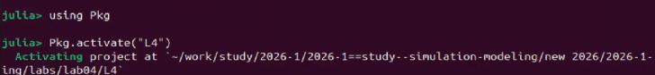
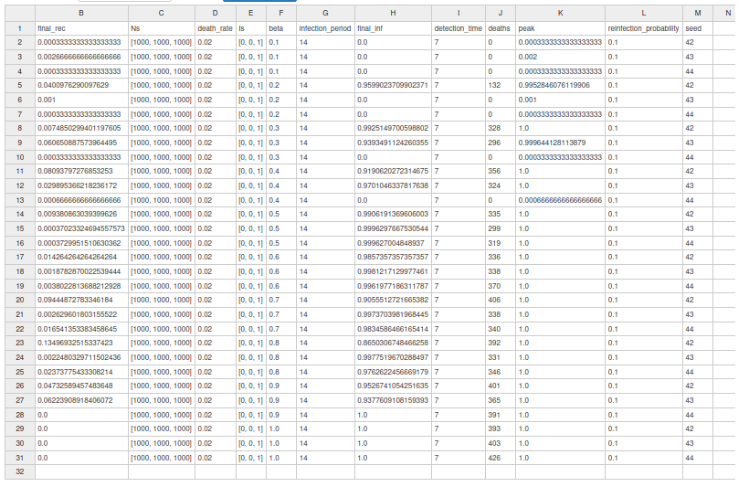
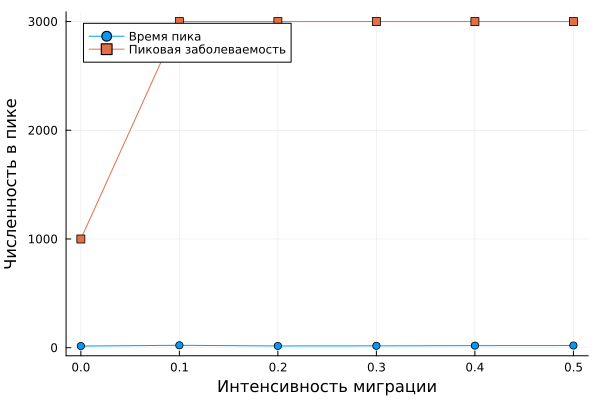
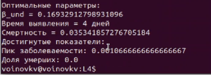
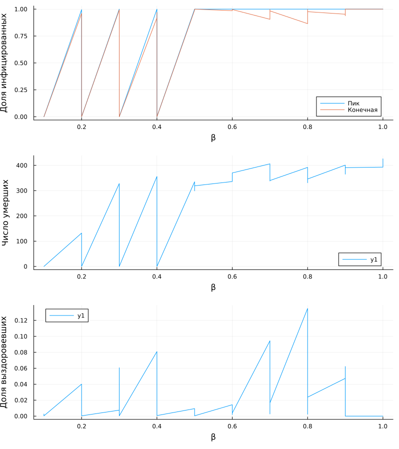
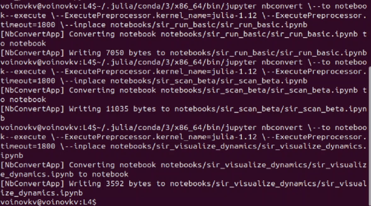
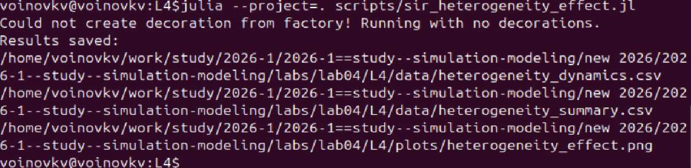
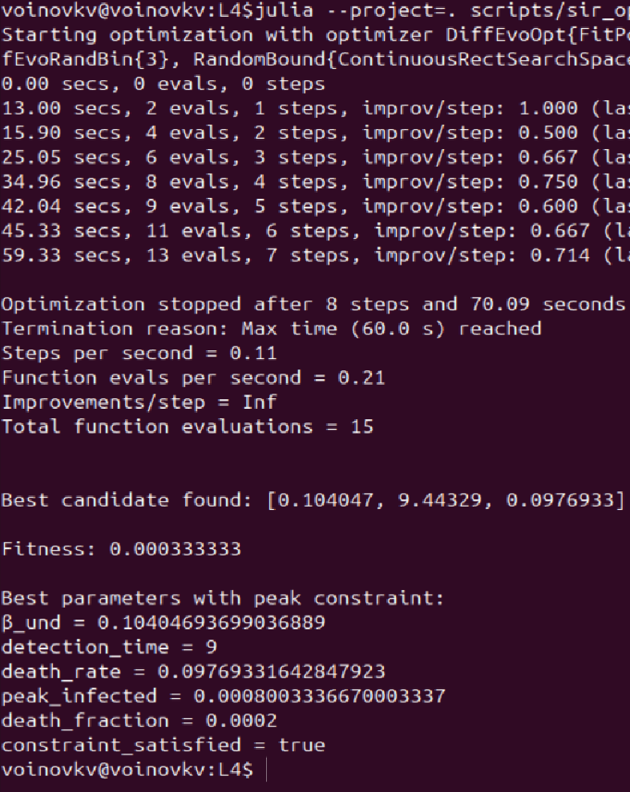

---
## Author
author:
  name: Воинов Кирилл
 
## Title
title: "Имитационное моделирование"
subtitle: "Лабораторная работа №4"
---

# Цель работы

Изучить реализацию эпидемиологической модели SIR в агентном подходе на языке Julia с использованием фреймворка Agents.jl, провести серию вычислительных экспериментов, подготовить literate-версии скриптов и исследовать дополнительные сценарии: порог эпидемии, гетерогенность городов, миграцию, карантин и оптимизацию с ограничением на пик заболеваемости.

# Задание

Создать рабочий каталог для кода.
Установить необходимые пакеты.
Выполнить предложенный код.
Преобразовать код в литературный стиль.
Сгенерировать из литературного кода:

    чистый код;
    jupyter notebook;
    документацию в формате Quarto.

Выполнить код из jupyter notebook.
Интегрировать документацию в формате Quarto в отчёт.
Добавить в код в литературном стиле вычисление для набора параметров.
Сгенерировать из литературного кода с параметрами:

    чистый код;
    jupyter notebook;
    документацию в формате Quarto.

Выполнить код из jupyter notebook с параметрами.
Интегрировать документацию с параметрами в формате Quarto в отчёт.

# Теоретическое введение

## Модель SIR

Классическая модель SIR делит популяцию на три группы: восприимчивые `S`, инфицированные `I` и выздоровевшие `R`.[@a_mathematical_2021; @z_sir_2021] В данной работе используется агентный подход, в котором каждый моделируется как отдельный агент. [@ermakov_agent_2023]
+
# Выполнение лабораторной работы

Запуск Julia ([рис. @fig-julia]) и инициализация проекта ([рис. @fig-proj])

{#fig-julia width=70%}

{#fig-proj width=70%}

## Реализация базовой SIR-модели

Исходный код модели был вынесен в файл `src/sir_model.jl`.

## Базовый эксперимент

Базовый запуск реализован в скрипте `sir_run_basic.jl` ([рис. @fig-run-basic]). 

{#fig-run-basic width=70%}

Результат базового эксперимента показан на [рис. @fig-run-basic-plot]. На графике видно, что число инфицированных быстро возрастает, затем достигает пика, после чего популяция постепенно переходит в класс выздоровевших. Пунктирная линия общей численности отражает влияние смертности.

{#fig-run-basic-plot width=70%}

## Исследование коэффициента заразности

Скрипт `sir_scan_beta.jl` ([рис. @fig-beta-script]) использовался для исследования порога эпидемии и чувствительности модели к параметру `beta`.

{#fig-beta-script width=70%}

На [рис. @fig-beta-plot] показан итоговый график зависимости характеристик эпидемии от `beta`. При '0.1' пик заражения практически отсутствует, а начиная с '0.2' наблюдается резкий рост амплитуды вспышки.

{#fig-beta-plot width=70%}

CSV-файл с результатами:

{#fig-beta-csv width=70%}

## Исследование миграции

Для анализа распространения инфекции между городами был использован скрипт `sir_migration_effect.jl` ([рис. @fig-migration-script]).

{#fig-migration-script width=70%}

График на [рис. @fig-migration-plot] показывает зависимость времени до пика и величины пика от интенсивности миграции. Нулевая миграция даёт локальную вспышку в одном городе, а при ненулевой миграции инфекция охватывает всю систему.

{#fig-migration-plot width=70%}

{#fig-migration-csv width=70%}

## Базовая оптимизация и итоговая визуализация

Скрипт `sir_optimize_parameters.jl` запускал многокритериальную оптимизацию параметров ([рис. @fig-opt-script],[рис. @fig-opt-script2]).

{#fig-opt-script width=70%}

{#fig-opt-script2 width=70%}

Скрипт `sir_visualize_dynamics.jl` строит сводный трёхпанельный график по результатам параметрического исследования [рис. @fig-vis-plot].

{#fig-vis-script width=70%}

{#fig-vis-plot width=70%}

Верхняя панель имеет пороговый вид, потому что система переходит от затухающей вспышки к почти полному охвату популяции. Средняя панель растёт вслед за ростом заражения: чем больше агентов проходят через инфекцию, тем больше итоговая смертность. Нижняя панель выходит на насыщение, потому что при больших `beta` почти вся популяция успевает переболеть.

## Производные форматы

Генерация производных форматов для скриптов [рис. @fig-forms].

{#fig-forms width=70%}

Выполнение Jupyter notebook для скриптов. [рис. @fig-ipynb].

{#fig-ipynb width=70%}

# Дополнительные задания

## Задание 1. Базовый уровень

Для базового уровня задание было выполнено ранее. По формуле получаем значение `R_0 > 1`, что соответствует устойчивому развитию эпидемии. Наблюдаемая динамика на графике согласуется с этим: заражение быстро растёт, затем почти вся популяция проходит через состояние `I`.

## Задание 2. Исследование порога

Порог эпидемии анализируется по результатам `beta_scan_all.csv`. Эпидемия считается возникшей, если пик `I` превышает `5%` популяции. При `beta = 0.1` это условие не выполняется, а при `0.2` уже появляются траектории с выраженной вспышкой. Практический порог в данной модели лежит между `0.1` и `0.2`.

Теоретический порог из условия `R_0 = 1` равен `beta = 0.07`, поэтому практический порог выше.

## Задание 3. Эффект гетерогенности

Для исследования Эффекта был подготовлен скрипт ([рис. @fig-hetero-script]).

{#fig-hetero-script width=70%}

Итоговый график [рис. @fig-hetero-plot] показывает отдельные траектории для каждого города. Видно, что города с большей заразностью выходят на более высокий и более ранний пик.

{#fig-hetero-plot width=70%}

## Задание 4. Миграция

Пункт 4 опирается на эксперимент миграции, уже описанный ранее.

По данным [рис. @fig-migration-csv] минимальное среднее время до пика достигается при `migration_intensity = 0.0`.

## Задание 5. Карантинные меры

Для анализа карантина была реализована модифицированная модель [рис. @fig-quarantine-script].

{#fig-quarantine-script width=70%}

Сравнительный график [рис. @fig-quarantine-plot] содержит три панели: число инфицированных, общую численность популяции и моменты закрытия городов. Он показывает, что в выбранной настройке карантин немного сдвигает пик вправо и снижает итоговое число умерших.

{#fig-quarantine-plot width=70%}

## Задание 6. Оптимизация 

Для задания был подготовлен скрипт ([рис. @fig-opt-constraint-script]).

{#fig-opt-constraint-script width=70%}

# Выводы

В ходе лабораторной работы была реализована агентная версия эпидемиологической модели SIR на языке Julia с использованием Agents.jl и DrWatson. 

# Список литературы{.unnumbered}
 
::: {#refs}
:::
