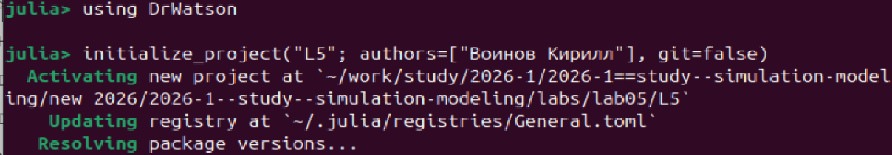
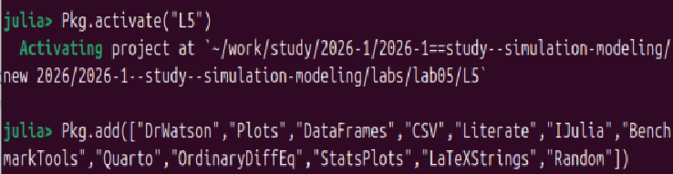
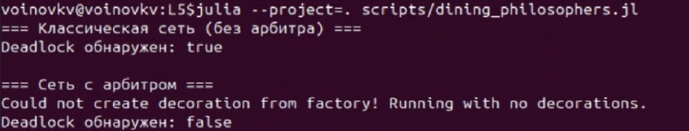
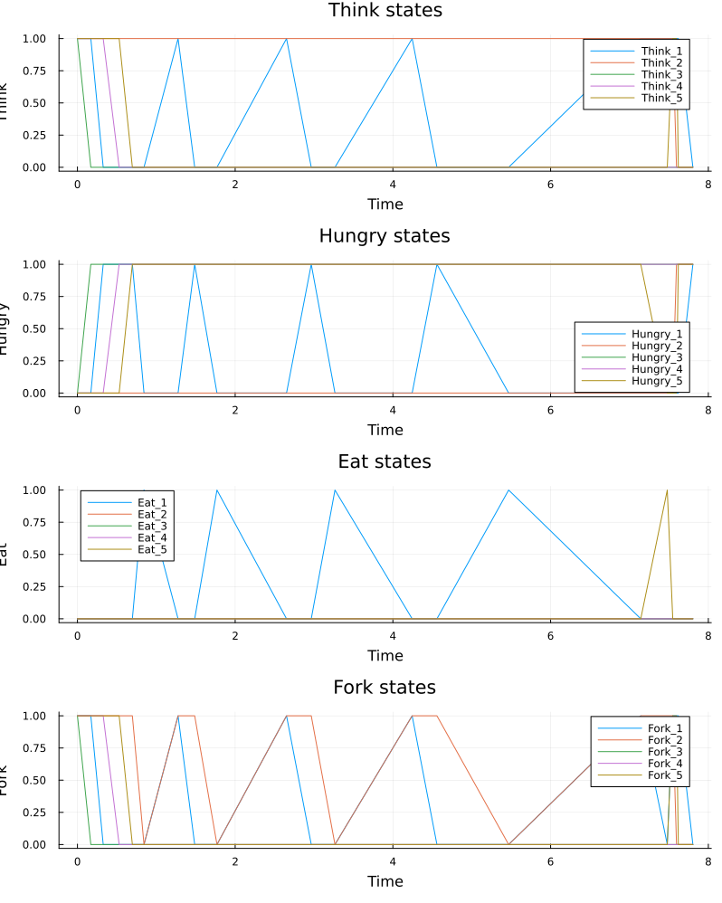
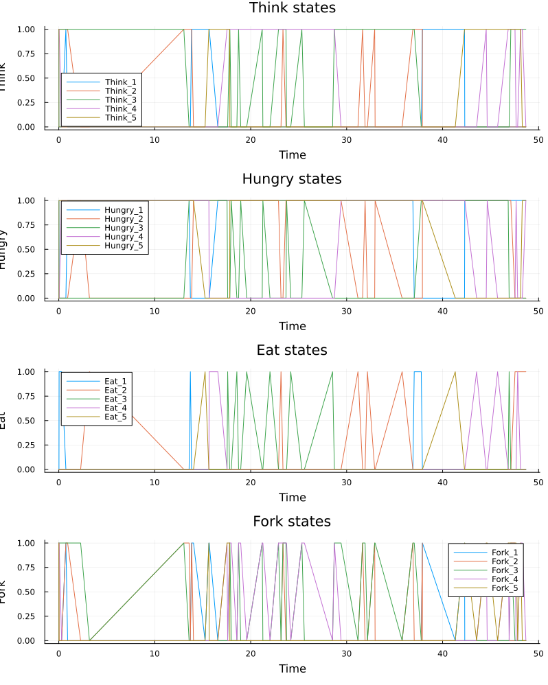
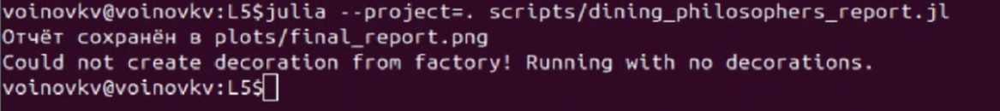
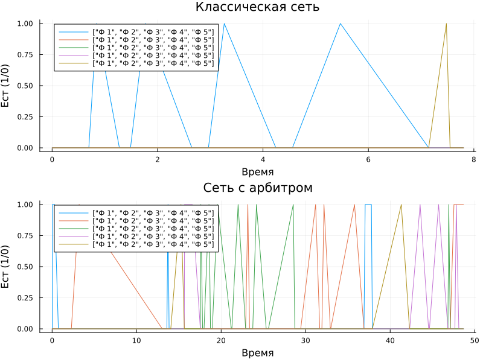
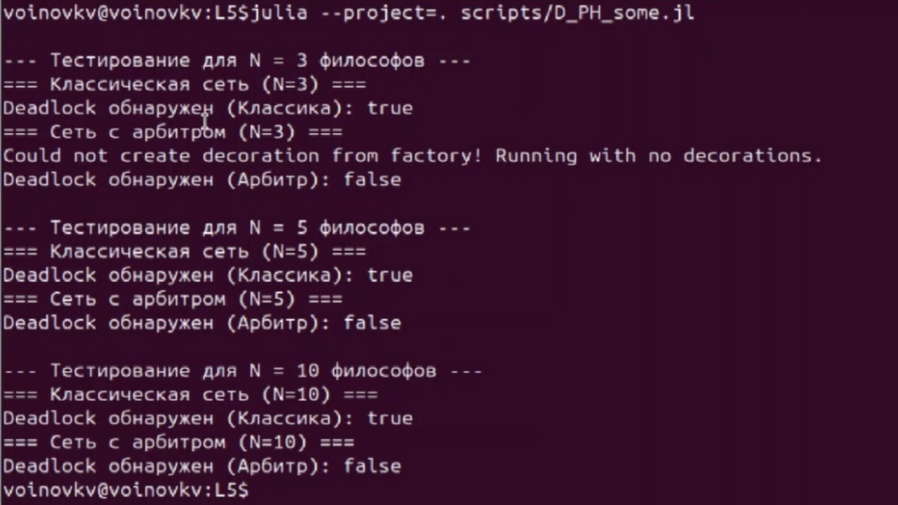
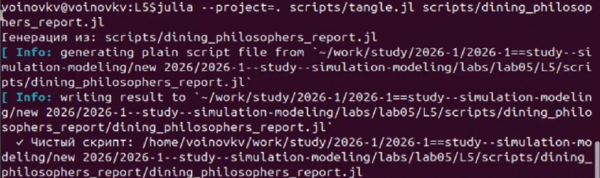
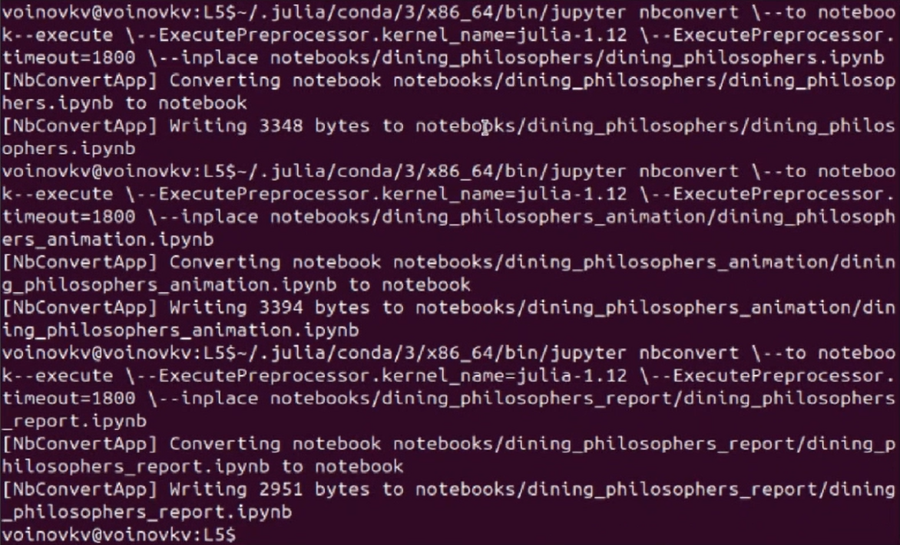

---
## Author
author:
  name: Воинов Кирилл
## Title
title: Презентация по лабораторной работе №5
date: today
date-format: "YYYY-MM-DD" 
---

# Информация

## Докладчик

:::::::::::::: {.columns align=center}
::: {.column width="70%"}

  * Воинов Кирилл Викторович
  1132236017 НФИбд-01-23

:::
::: {.column width="30%"}

:::
::::::::::::::

# Цель работы и теоретическое введение

## Цель работы
 
- Изучить аппарат сетей Петри на примере задачи обедающих философов
- Реализовать модель на Julia в проекте DrWatson
- Провести базовые и параметрические эксперименты
 
## Сеть Петри и задача обедающих философов
 
- Позиции описывают состояния системы
- Переходы описывают события
- В классической задаче возможен deadlock
- Arbiter` устраняет тупиковую конфигурацию
 
# Настройка окружения
 
## Инициализация и активация проекта, загрузка библиотек 
 
{width=48%}
{width=48%}
  
# Базовый эксперимент
 
## Запуск основного скрипта
 
{width=42%}
 
- Запуск основного скрипта `dining_philosophers.jl`
 
## Сеть с и без арбитра 
 
{width=32%}
{width=28%}
 
- На слайде показаны график сети с арбитром и график классической сети.
- В отличие от классической сети, в сети с арбитром deadlock не возникает.
 
# Анимация процесса
 
## Запуск скрипта анимации
 
{width=62%}
 
- Скрипт `dining_philosophers_animation.jl` строит GIF-анимацию изменения сети 
 
# Итоговый сравнительный график
 
## Запуск скрипта отчёта и итоговый график
 
{width=42%}
{width=45%}
 
- Слева показан скрипт `dining_philosophers_report.jl`, который загружает ранее сохранённые CSV-файлы.
- Справа расположен итоговый график: в классической сети все `Eat_i` падают к нулю, а в сети с арбитром активность сохраняется.
  
# Параметрическое исследование
 
## Запуск скрипта параметрического анализа
 
{width=42%}
 
- скрипт перебирает `N`.

## Производные форматы 

{width=50%}
{width=50%}

- Для каждого эксперимента добавлено описание в стилистике литературного програмирования, получены производные форматы и выполнены Jupyter notebook.
 
# Выводы
 
## Итоги лабораторной работы
 
- Реализована сеть Петри для задачи обедающих философов
- Для классической сети deadlock возникает во всех запусках
- Для сети с арбитром deadlock не возникает.
