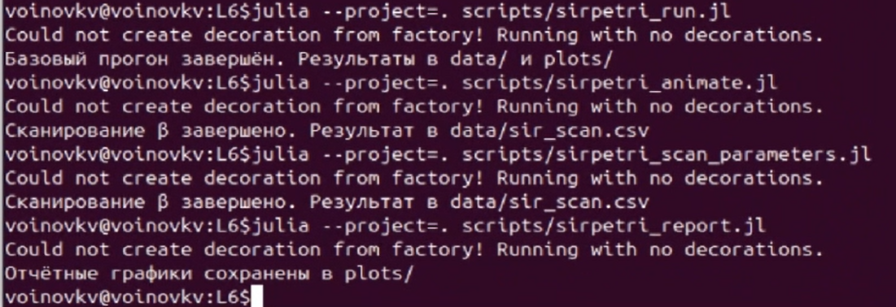
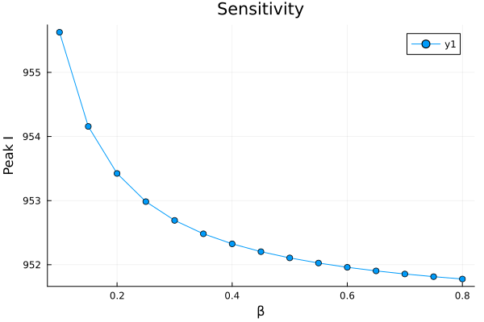
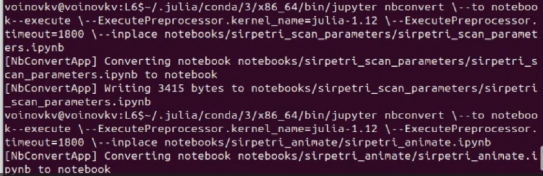

---
## Author
author:
  name: Воинов Кирилл
## Title
title: Презентация по лабораторной работе №6
date: today
date-format: "YYYY-MM-DD" 
---

# Информация

## Докладчик

:::::::::::::: {.columns align=center}
::: {.column width="70%"}

  * Воинов Кирилл Викторович
  * 1132236017 
  * НФИбд-01-23

:::
::: {.column width="30%"}

:::
::::::::::::::

# Цель работы

## Цель работы
 
- Изучить реализацию модели SIR в аппарате сетей Петри
- Реализовать модель на Julia в проекте DrWatson
- Провести базовые и параметрические эксперименты
 
# Выполнение лабораторной работы
 
## Настройка окружения
 
{width=70%}

{width=50%}
  
## Выполнение скриптов

{width=70%}
 
## Реализация базовой SIR-модели
 
{width=62%}

## Реализация базовой SIR-модели

{width=62%}
 
- На детерминированном графике число восприимчивых практически мгновенно падает к нулю. Почти вся популяция за короткое время переходит в состояние заражения, а затем плавно выздоравливает.

- Стохастическая траектория имеет ступенчатый характер.

## Анимация процесса
 
- Скрипт строит анимацию изменения сети. Скрипт в задании не отображается.

## Параметрическое исследование
 
Параметрический скрипт выполняет серию запусков.

{width=70%}
 
## Итоговые графики
 
{width=50%}

## Итоговые графики

{width=50%}

## Производные форматы 

{width=50%}
{width=50%}

- Для каждого эксперимента добавлено описание в стилистике литературного програмирования, получены производные форматы и выполнены Jupyter notebook.
 
# Выводы
 
## Итоги лабораторной работы
 
- Реализована модель SIR в аппарате сетей Петри
- Получены детерминированная и стохастическая траектории
- Выполнены параметрический анализ 
- Для каждого сценария получены производные форматы
- Результаты интегрированы в отчёт и презентацию
