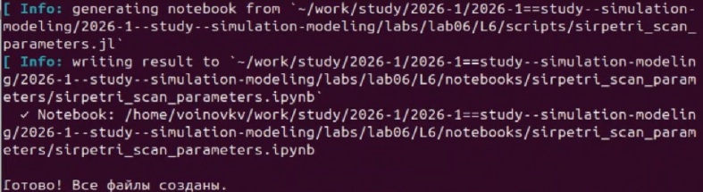

---
## Author
author:
  name: Воинов Кирилл
 
## Title
title: "Имитационное моделирование"
subtitle: "Лабораторная работа №6"
---

# Цель работы

Изучить реализацию модели SIR в аппарате сетей Петри, выполнить, эксперименты, подготовить графики, а также подготовить производные форматы.

# Задание

1. Создать рабочий каталог и проект Julia в структуре DrWatson.
2. Установить необходимые пакеты.
4. Выполнить базовый эксперимент.
5. Построить анимацию изменений.
6. Сформировать итоговый сравнительный график.
7. Выполнить параметрическое исследование.
8. Подготовить производные форматы.

# Теоретическое введение

Сеть Петри представляет собой ориентированный двудольный граф, в котором позиции задают состояния системы, переходы описывают события, дуги определяют разрешённые связи, а маркировка показывает текущее распределение фишек по позициям [@peterson1981]. Такой аппарат удобен для моделирования дискретных событий и конкурирующих процессов.

В данной лабораторной работе рассматривается эпидемическая модель SIR с тремя состояниями:
 
- `S` --- восприимчивые;
- `I` --- инфицированные;
- `R` --- выздоровевшие.

# Выполнение лабораторной работы

## Подготовка окружения

Запуск Julia [@bezanson2017] и инициализация проекта ([рис. @fig-julia]). 

{#fig-julia width=70%}

Активация проекта и загрузка библиотек ([рис. @fig-proj]).

{#fig-proj width=70%}

## Реализация SIR-моделей
 
{width=70%}

## Реализация базовой SIR-модели

{width=62%}
 
На детерминированном графике видно, что число восприимчивых практически мгновенно падает к нулю.
Таким образом, в текущей реализации модель даёт очень жёсткую вспышку: почти вся популяция за короткое время переходит в состояние заражения, а затем плавно выздоравливает.
 
График `sir_stoch_dynamics.png`
 
{width=62%}
 
Стохастическая траектория имеет ступенчатый характер.
 
## Анимация процесса

Скрипт строит анимацию изменения сети. Скрипт в задании не отображается.

## Параметрическое исследование

Параметрический скрипт выполняет серию запусков.

{width=70%}

График содержит две кривые:
 
- `Peak I(β)` --- максимальное число инфицированных;
- `Final R(β)` --- итоговое число выздоровевших.

## Итоговый сравнительный отчёт

Итоговый сценарий объединяет результаты базового прогона и параметрического анализа в отдельные отчётные рисунки.

{width=70%}
 
{width=70%}

На графике совместно показаны кривые `I(t)` для двух режимов моделирования. Стохастическая траектория стартует резче и быстрее достигает пика, тогда как детерминированная аппроксимация остаётся гладкой. Обе кривые отражают одну и ту же общую картину: резкий всплеск числа инфицированных и последующее затухание.

## Производные форматы

Генерация производных форматов для скриптов с описанием в стилистике литературного програмирования [рис. @fig-forms].

{#fig-forms width=70%}

Выполнение Jupyter notebook для скриптов. [рис. @fig-ipynb].

{#fig-ipynb width=70%}

# Выводы

В ходе выполнения лабораторной работы была реализована модель SIR в аппарате сетей Петри, подготовлен модуль `SIRPetri.jl` и набор сценариев для базового прогона, параметрического исследования и итогового анализа. Для базового эксперимента были получены две траектории: гладкая детерминированная и событийная стохастическая.

# Список литературы{.unnumbered}
 
::: {#refs}
:::
