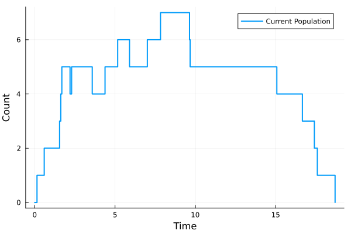
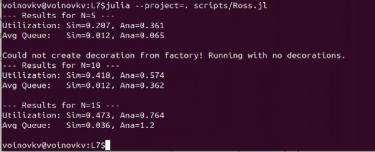
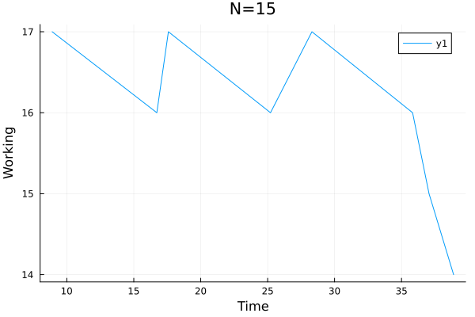
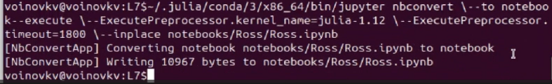

---
## Author
author:
  name: Воинов Кирилл
## Title
title: Презентация по лабораторной работе №7
date: today
date-format: "YYYY-MM-DD" 
---

# Информация

## Докладчик

:::::::::::::: {.columns align=center}
::: {.column width="70%"}

  * Воинов Кирилл Викторович
  * 1132236017 
  * НФИбд-01-23

:::
::: {.column width="30%"}

:::
::::::::::::::

# Цель работы

## Цель работы
 
- Изучить реализацию модели M/M/c и модели Росса
- Реализовать модель на Julia в проекте DrWatson
- Подготовить графики
- Подготовить производные форматы.
 
# Выполнение лабораторной работы
 
## Настройка окружения
 
Запуск Julia и инициализация проекта 

{#fig-julia width=70%}

## Настройка окружения

Активация проекта проекта

{#fig-julia2 width=70%}

## Настройка окружения

Загрузка библиотек

{#fig-proj width=70%}

## Модель M/M/c

{#fig-mms width=50%}

## Полученный график

{#fig-mmsg width=50%}

## Модель Росса

{#fig-ross width=70%}

## График Росса N=5

{#fig-ross5 width=70%}

## График Росса N=10

{#fig-ross10 width=70%}

## График Росса N=15

{#fig-ross15 width=70%}

## Производные форматы 

{#fig-forms width=45%}

- Для каждого эксперимента добавлено описание в стилистике литературного програмирования, получены производные форматы и выполнены Jupyter notebook.

## Выполнение Jupyter notebook для скриптов.

{#fig-ipynb width=70%}

{#fig-ipynb2 width=70%}
 
# Выводы
 
## Итоги лабораторной работы
 
В ходе выполнения лабораторной работы были реализованы модели M/M/c и Росса. Добавленно возможность несколько ремонтников. Сделан прогон для разного количества машин. Проведен мониторинг загрузки ремонтника, средней длины очереди на ремонт. Построены графиков изменения числа исправных машин во времени.

