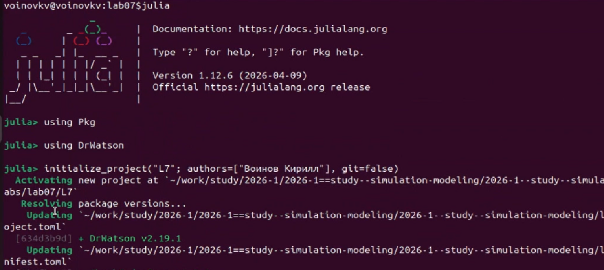
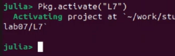
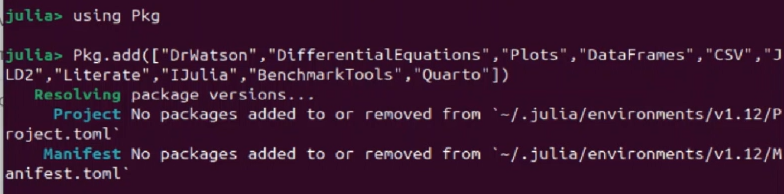
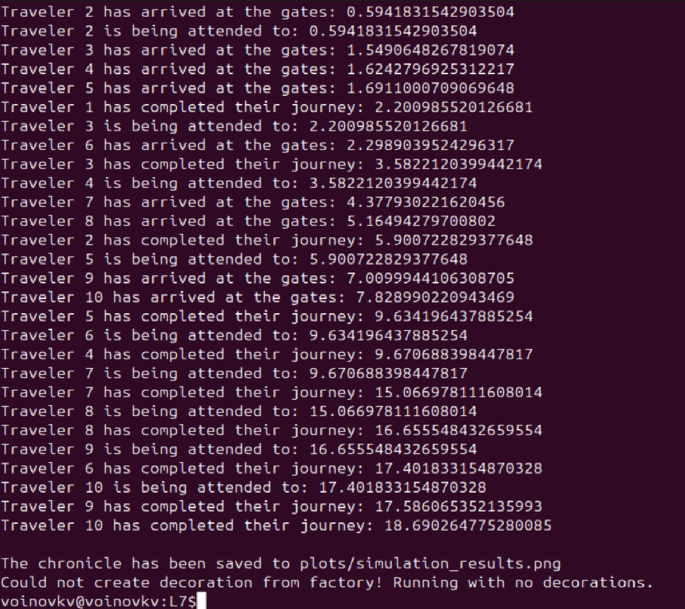
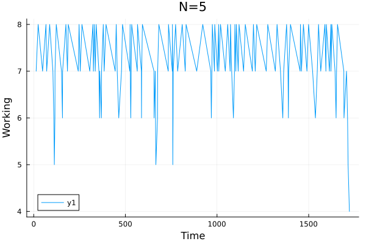
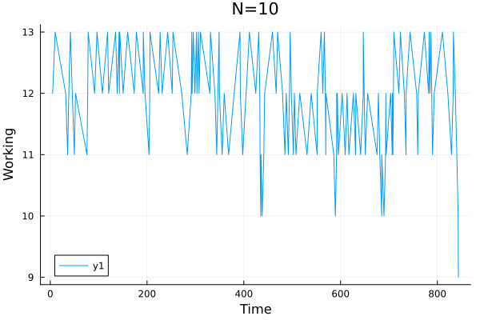
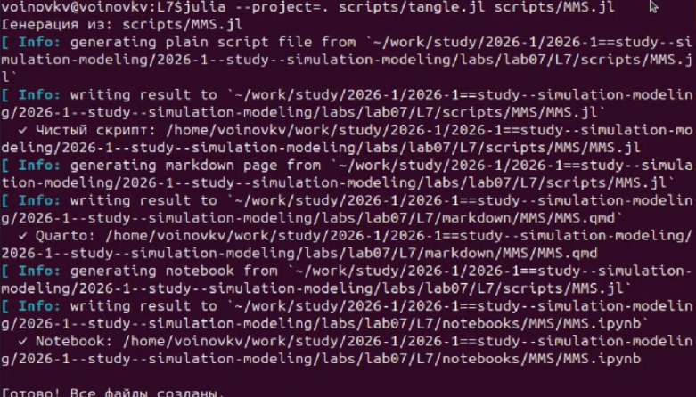
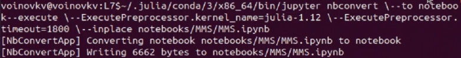

---
## Author
author:
  name: Воинов Кирилл
 
## Title
title: "Имитационное моделирование"
subtitle: "Лабораторная работа №7"
---

# Цель работы

Изучить реализацию модели M/M/c и модели Росса, выполнить, эксперименты, подготовить графики, а также подготовить производные форматы.

# Задание

1. Создать рабочий каталог и проект Julia в структуре DrWatson.
2. Установить необходимые пакеты.
4. Выполнить базовый эксперимент.
5. Сделать прогон для разного количества машин.
6. Провести мониторинг загрузки ремонтника, средней длины очереди на ремонт.
7. Построить графиков изменения числа исправных машин во времени.
8. Сравнить с аналитическим решением.

# Теоретическое введение

Модель M/M/c [@ross_simulation_2019] (по классификации Кендалла) — это система массового обслуживания со следующими свойствами:

-    M (Markovian) — входящий поток заявок пуассоновский.
-    M — время обслуживания каждой заявки.
-    c — количество идентичных обслуживающих приборов (каналов), работающих параллельно.
    
Марковская модель [@fundamentals_2018] может быть описана как марковский процесс с непрерывным временем и конечным числом состояний. Состояние можно определить как число работоспособных машин (работающих плюс резервных) или число машин в ремонте.

# Выполнение лабораторной работы

## Подготовка окружения

Запуск Julia [@bezanson2017] и инициализация проекта ([рис. @fig-julia]). 

{#fig-julia width=70%}

Активация проекта проекта ([рис. @fig-julia2]). 

{#fig-julia2 width=70%}

Загрузка библиотек ([рис. @fig-proj]).

{#fig-proj width=70%}

## Модель M/M/c

Выполнениия файла ([рис. @fig-mms]).

{#fig-mms width=70%}

Полученный график ([рис. @fig-mmsg]).

{#fig-mmsg width=70%}

## Модель Росса

Выполнениия файла ([рис. @fig-ross]).

{#fig-ross width=70%}

Полученные графики ([рис. @fig-ross5], [рис. @fig-ross10], [рис. @fig-ross15]).

{#fig-ross5 width=70%}

{#fig-ross10 width=70%}

{#fig-ross15 width=70%}

## Производные форматы

Генерация производных форматов для скриптов с описанием в стилистике литературного програмирования [рис. @fig-forms].

{#fig-forms width=70%}

Выполнение Jupyter notebook для скриптов. ([рис. @fig-ipynb], [рис. @fig-ipynb2]).

{#fig-ipynb width=70%}

{#fig-ipynb2 width=70%}

# Выводы

В ходе выполнения лабораторной работы были реализованы модели M/M/c и Росса. Добавленно возможность несколько ремонтников. Сделан прогон для разного количества машин. Проведен мониторинг загрузки ремонтника, средней длины очереди на ремонт. Построены графиков изменения числа исправных машин во времени.

# Список литературы{.unnumbered}
 
::: {#refs}
:::
